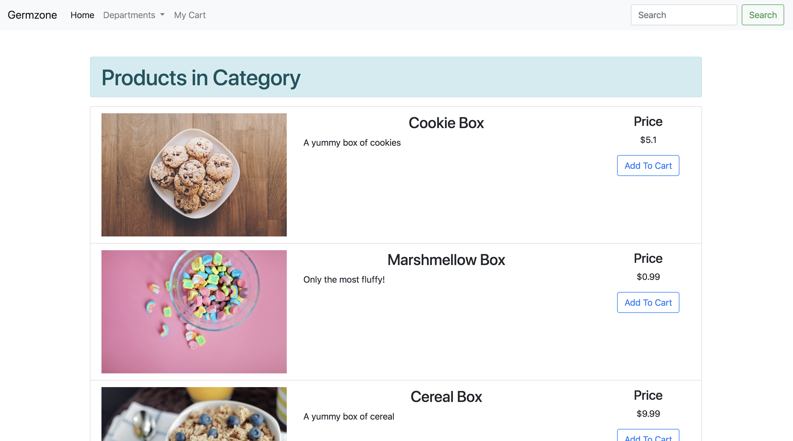

# Germzone
 *Shopping redifined*

[Visit the main store] (https://germzone-shop.herokuapp.com/)

[Visist the admin page] (https://germzone-shop.herokuapp.com/admin.html)

## Why does this exist? 
This project is a dive into working with relational databases and implementing a _CRUDY_ store with them. 

## What I learned from this project 

First and foremost, 
Make sure to understand the data models you are going to need before starting to code. Relational databases are not forgiving when it comes to changing the schema after the project has started. I also learned to to structure my app using MVC which made error tracking much easier. 

I also enjoyed making a hybrid app in the sense that the view was all rendered in the client side. 

## Techs used

### Backend 
* Node.js
* Express.js 
* mySQL.

## Frontend
* jQuery 
* CSS3
* Bootstrap 